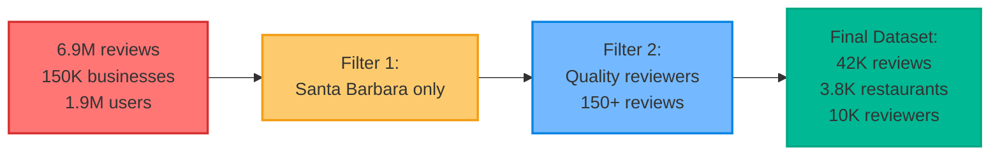
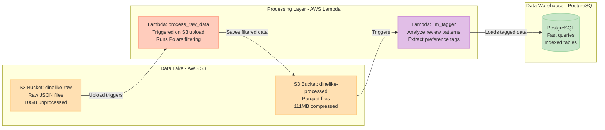
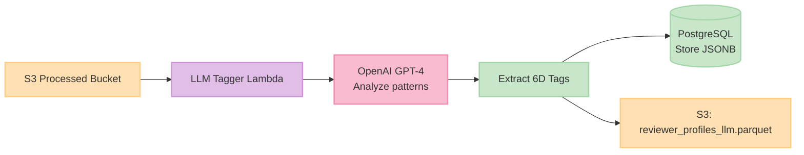
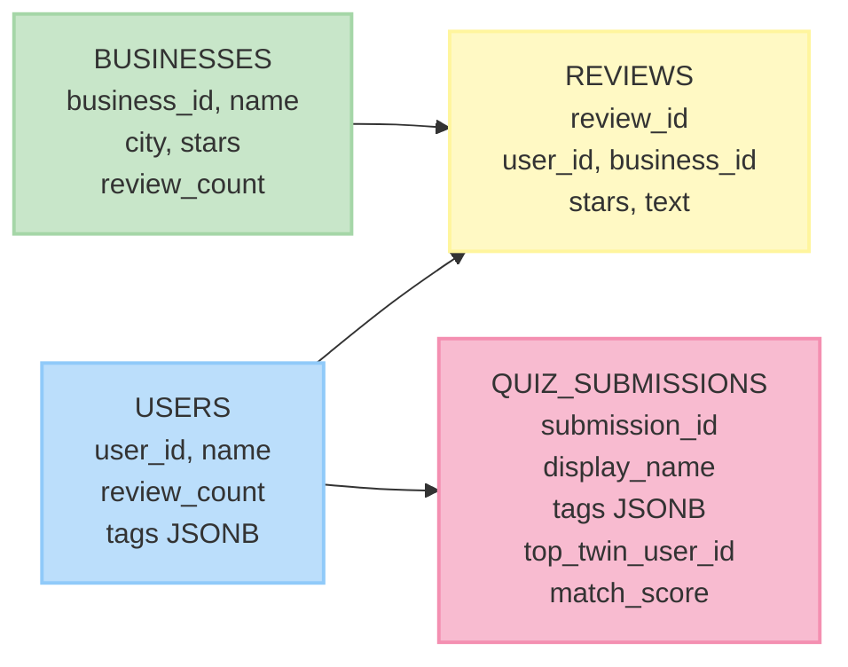
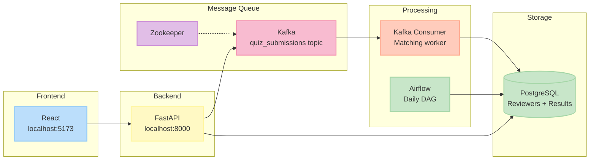
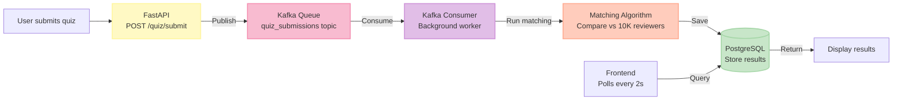
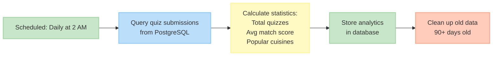

<div align="center">

# DineLike

**Ever wish you had a friend who just *gets* your taste in restaurants?**

[](https://github.com/Vihaan8/final_project/actions/workflows/ci.yml)


**Team:** Vihaan Manchanda • Anvita Suresh • Tea Tafaj • Arushi Singh  
**Course:** IDS 706 - Data Engineering Systems, Duke University  
**Video Link:** -  https://drive.google.com/file/d/1IuMpWKLTlaG_SYVf6mv48D2on8-5oEZM/view?usp=sharing

</div>

---

## Problem Statement

DineLike solves a simple problem: **finding restaurants that match YOUR taste is hard.**

Traditional restaurant apps show you generic 4-star ratings or let you filter by cuisine and price. But that doesn't tell you if a "great Italian place" matches YOUR idea of great Italian. Do you care more about authentic ingredients or cozy atmosphere? Are you adventurous or do you stick to familiar dishes?

**Our Solution:**
1. You take a quick quiz about your dining preferences (6 categories)
2. We match you with your "Taste Twin" - a real reviewer who shares your exact taste profile
3. You see restaurants your twin loves, with their actual reviews

Think of it like having a foodie friend who knows exactly what you like - except we found that friend by analyzing 10,000+ reviewers and 42,000+ reviews using machine learning.

**The Result:** Personalized recommendations that actually match your taste, not generic ratings.

---

## Table of Contents

- [Project Structure](#project-structure)
- [What We Built](#what-we-built)
- [Quick Start](#quick-start)
- [Exploratory Data Analysis](#exploratory-data-analysis)
- [Data Architecture](#data-architecture)
- [The Matching Algorithm](#the-matching-algorithm)
- [System Architecture](#system-architecture)
- [Testing & CI/CD](#testing--cicd)
- [Complete User Journey](#complete-user-journey)
- [Data Engineering Undercurrents](#data-engineering-undercurrents)
- [Team Contributions](#team-contributions)
- [Video Link](#video-link)

---

## Project Structure
```
final_project/
├── data/
│   ├── raw/                    # Original Yelp dataset (not in repo)
│   └── final/                  # Processed parquet files (111MB)
│       ├── businesses_final.parquet
│       ├── users_final.parquet
│       ├── reviews_final.parquet
│       └── reviewer_profiles_llm.parquet
│
├── src/
│   ├── api/                    # FastAPI backend
│   │   ├── main.py            # API server
│   │   └── routes/            # Endpoints (quiz, results, community)
│   ├── matching/              # Core matching algorithm
│   │   └── matcher.py         # 6-dimensional preference matching
│   └── services/              # Background services
│       ├── kafka_consumer.py  # Processes quiz submissions
│       └── init_db.py         # Loads data into PostgreSQL
│
├── frontend/                   # React application
│   ├── src/
│   │   ├── components/        # Quiz form, results display
│   │   └── App.jsx           # Main app
│   └── package.json
│
├── sql/
│   └── 01_schema.sql          # PostgreSQL table definitions
│
├── airflow/
│   └── dags/
│       └── daily_stats.py     # Daily batch processing
│
├── lambda/                     # AWS Lambda functions
│   ├── process_raw_data.py    # S3 trigger processing
│   └── llm_tagger.py          # Tag extraction
│
├── tests/
│   ├── unit/                  # 15 unit tests
│   ├── integration/           # 21 integration tests
│   └── e2e/                   # 1 full end-to-end test
│
├── docker-compose.yml         # Infrastructure definition
├── Dockerfile.api             # API container
├── Dockerfile.consumer        # Consumer container
└── README.md                  # This file
```

**Key Directories:**
- **data/final/**: Production-ready processed data (what gets loaded into database)
- **src/**: All Python application code
- **frontend/**: React UI
- **lambda/**: AWS serverless functions for data processing
- **tests/**: Comprehensive test suite
- **airflow/**: Scheduled batch jobs

---

## What We Built

### High-Level System Overview

**How DineLike Works: From Raw Data to Personalized Recommendations**

```mermaid
graph LR
    subgraph "1. DATA COLLECTION"
        A[Yelp Dataset<br/>6.9M reviews<br/>150K businesses<br/>1.9M users]
    end
    
    subgraph "2. DATA LAKE - AWS S3"
        B[S3: dinelike-raw<br/>10GB JSON files<br/>Raw unprocessed data]
        C[Lambda: process_raw_data<br/>Polars filtering<br/>Geographic + Quality filters]
        D[S3: dinelike-processed<br/>111MB Parquet files<br/>10K reviewers, 42K reviews]
    end
    
    subgraph "3. LLM ANALYSIS"
        E1[Lambda: llm_tagger<br/>Reads all reviews per user<br/>Sends to OpenAI GPT-4]
        
        E2[LLM condenses into 6 tags<br/>cuisines, priorities, dining_style<br/>meal_timing, adventure, price]
        
        E3[Repeat for all 10K users<br/>Store as JSONB in database]
    end
    
    subgraph "4. DATA WAREHOUSE"
        G[(PostgreSQL<br/>10,263 reviewers with JSONB tags<br/>42,687 reviews<br/>3,829 restaurants)]
    end
    
    subgraph "5. USER APPLICATION"
        H[User Takes Quiz<br/>Same 6 questions<br/>Creates matching JSONB structure]
        I[Matching Algorithm<br/>Compare user JSONB vs 10K reviewer JSONBs<br/>Find best match mathematically]
        J[React Frontend<br/>Display Twin + Restaurants + Community]
    end
    
    A --> B
    B --> C
    C --> D
    D --> E1
    E1 --> E2
    E2 --> E3
    E3 --> G
    
    H --> I
    G --> I
    I --> J
    
    style A fill:#E3F2FD,stroke:#90CAF9,stroke-width:2px
    style B fill:#FFE0B2,stroke:#FFCC80,stroke-width:2px
    style C fill:#FFCCBC,stroke:#FFAB91,stroke-width:2px
    style D fill:#FFE0B2,stroke:#FFCC80,stroke-width:2px
    style E1 fill:#E1BEE7,stroke:#CE93D8,stroke-width:2px
    style E2 fill:#F8BBD0,stroke:#F48FB1,stroke-width:2px
    style E3 fill:#C8E6C9,stroke:#A5D6A7,stroke-width:2px
    style G fill:#C8E6C9,stroke:#A5D6A7,stroke-width:2px
    style H fill:#BBDEFB,stroke:#90CAF9,stroke-width:2px
    style I fill:#F8BBD0,stroke:#F48FB1,stroke-width:2px
    style J fill:#DCEDC8,stroke:#C5E1A5,stroke-width:2px
```



**Understanding the Flow:**

**Layer 1: Data Collection** - Start with Yelp's massive public dataset (6.9M reviews, 150K businesses, 1.9M users)

**Layer 2: Data Lake (AWS S3 + Lambda)** - Filter data by geography (Santa Barbara only) and quality (reviewers with 150+ reviews), reducing dataset from 10GB to 111MB of high-quality data stored in dual S3 buckets

**Layer 3: LLM Analysis** - Use OpenAI GPT-4 to read each reviewer's 150+ text reviews and condense them into 6 structured preference tags (cuisines, priorities, dining_style, meal_timing, adventure_level, price_sensitivity), stored as JSONB for fast comparison

**Layer 4: Data Warehouse** - Load tagged profiles into PostgreSQL for instant queries (<100ms response time)

**Layer 5: User Application** - Users take the same 6-question quiz, creating a matching JSONB structure. The matching algorithm compares mathematically against 10K pre-tagged reviewers to find the best taste twin, then displays personalized restaurant recommendations

---

## Quick Start

### Containerization with Docker

DineLike uses Docker Compose to orchestrate 7 services in isolated containers, ensuring consistent behavior across development, testing, and production environments. Each service runs in its own container with defined dependencies, health checks, and restart policies.

**Services Containerized:**

| Container | Image | Purpose |
|-----------|-------|---------|
| `dinelike-postgres` | postgres:15 | Database with health checks |
| `dinelike-api` | Custom (Dockerfile.api) | FastAPI backend |
| `dinelike-consumer` | Custom (Dockerfile.consumer) | Kafka consumer worker |
| `dinelike-frontend` | node:20 | React development server |
| `dinelike-kafka` | confluentinc/cp-kafka:7.5.0 | Message queue |
| `dinelike-zookeeper` | confluentinc/cp-zookeeper:7.5.0 | Kafka coordination |
| `dinelike-airflow` | apache/airflow:2.7.3 | Batch orchestration (optional) |

### One-Command Deployment
```bash
# 1. Clone the repo
git clone https://github.com/Vihaan8/final_project.git
cd final_project

# 2. Start everything 
docker-compose up -d

# 3. Wait ~60 seconds for data to load, then open:
# - Frontend: http://localhost:5173
# - API: http://localhost:8000
# - API Docs: http://localhost:8000/docs
```

**What Just Happened:**

- PostgreSQL started and loaded 111MB of data (10,263 reviewers, 3,829 restaurants, 42,687 reviews)
- Kafka message queue started for real-time processing
- FastAPI backend launched (handles quiz submissions)
- Kafka consumer started (runs matching algorithm)
- React frontend served (the quiz interface)

**Optional: Start Airflow**
```bash
docker-compose --profile with-airflow up -d
# Access at http://localhost:8080 (admin/admin)
```

### Stopping Everything
```bash
docker-compose down       # Stop services
docker-compose down -v    # Stop and delete data
```

**Requirements:**

- Docker Desktop
- 8GB RAM
- 5GB disk space


---
## Troubleshooting Setup

<details>
<summary><strong>🚨 Running into issues? (Quiz not submitting, services not starting, port conflicts)</strong></summary>

### Common First-Time Setup Issues

If you're experiencing any of these problems:
- Quiz submission hangs or fails
- "Port already in use" errors
- Database connection errors
- Kafka consumer not processing messages
- Frontend can't connect to API

**This usually happens because:**
- Previous Docker containers didn't shut down cleanly
- Stale data volumes have corrupted or outdated data
- Ports are still held by zombie processes
- Kafka/Zookeeper state is inconsistent

---

### The Fix: Clean Reset

**Option 1: Standard Reset (Try This First)**

```bash
docker-compose down -v --remove-orphans
docker-compose up -d
```

This stops all services, removes volumes (database data), removes orphaned containers, and starts fresh.

---

**Option 2: If Option 1 Doesn't Work**

If you're still having issues, run this command to completely wipe Docker and start fresh:

```bash
docker system prune -a --volumes -f && docker-compose up -d
```

⚠️ **Warning: This will delete:**
- All stopped containers
- All unused Docker images
- All volumes (including data from other projects)
- All build cache

**Only use this if you don't have other Docker projects with important data.**

---

### What the Command Does

```bash
# 1. Stop all running containers
docker stop $(docker ps -aq)

# 2. Remove all containers
docker rm $(docker ps -aq)

# 3. Remove all images
docker rmi $(docker images -q)

# 4. Remove all volumes (including database data)
docker volume rm $(docker volume ls -q)

# 5. Remove all networks
docker network prune -f

# 6. Remove all build cache
docker builder prune -a -f

# 7. Verify everything is gone
docker ps -a      # Should be empty
docker images     # Should be empty
docker volume ls  # Should be empty

# 8. Now start fresh
docker-compose up -d
```


### After Reset

Wait ~60 seconds for all services to initialize, then:
- Frontend: http://localhost:5173
- API: http://localhost:8000
- API Docs: http://localhost:8000/docs

</details>


---

## Exploratory Data Analysis

Before building the pipeline, we explored the raw Yelp dataset using Polars to understand its structure and identify filtering opportunities. The dataset contains 150,346 businesses across multiple US cities, 1.9 million users, and 6.9 million reviews—far too large for our project scope.


*Geographic distribution analysis: Santa Barbara ranked 10th in business count but showed strong review activity relative to its size*


*Santa Barbara businesses average 4.05 stars with a healthy distribution of review counts, indicating active reviewer engagement*


Our EDA informed two key filtering decisions: (1) focus on Santa Barbara, CA to reduce 150K businesses to 3,829 restaurants while maintaining cuisine diversity, and (2) filter to reviewers with 150+ reviews, reducing 1.9M users to 10,263 quality reviewers whose preferences could be meaningfully profiled. This reduced our working dataset from ~10GB to 111MB while preserving the data richness needed for accurate taste matching.


---

## Data Architecture


### Phase 1: Raw Data Collection

**Source:** Yelp Academic Dataset (publicly available)

**What We Started With:**
```
Raw Yelp Dataset:
├── yelp_academic_dataset_business.json (150K businesses, all US cities)
├── yelp_academic_dataset_user.json (1.9M users/reviewers)
└── yelp_academic_dataset_review.json (6.9M reviews)

Total Size: ~10GB in JSON format
```

**The Challenge:** This is WAY too much data for a course project. We needed to filter it down while keeping enough data to make meaningful recommendations.

### Phase 2: Data Filtering & Transformation

**Tool Used:** Polars (10x faster than Pandas)

**Why Polars?**
- Handles multi-GB datasets efficiently
- Lazy evaluation (only processes what you need)
- 10x faster than Pandas for our filtering operations

**Filtering Strategy:**


**Filter 1: Geographic Focus**
```python
import polars as pl

# Load massive dataset
businesses = pl.read_parquet("yelp_businesses.parquet")

# Keep only Santa Barbara, CA
sb_businesses = businesses.filter(
    (pl.col("city") == "Santa Barbara") & 
    (pl.col("state") == "CA")
)

# Result: 150K → 3,829 businesses
```

**Why Santa Barbara?**
- Manageable dataset size (3.8K restaurants vs 150K)
- Diverse food scene (Italian, Mexican, Asian, American)
- Enough data for meaningful matching (42K reviews)
- Tourist + local mix = varied reviewer preferences

**Filter 2: Quality Reviewers**
```python
# Only keep reviewers with 150+ reviews
quality_reviewers = users.filter(
    pl.col("review_count") >= 150
)

# Result: 1.9M → 10,263 reviewers
```

**Why 150+ reviews?**
- Shows established preferences (not one-time visitors)
- Enough review history to analyze patterns
- These are the "foodies" - people who eat out regularly
- Balances data quality vs quantity (10K is perfect for matching)

**Processing Time:**
- Polars: 45 seconds
- Pandas (tested): 8 minutes
- **Decision:** Use Polars for all data processing

### Phase 3: Cloud Storage & Processing

**Architecture: Data Lake + Data Warehouse**


**Why This Architecture?**

**Data Lake (S3):**
- **Purpose:** Long-term storage of raw and processed data
- **Cost:** $0.023/GB/month (vs PostgreSQL $0.10+/GB)
- **Benefit:** Can always re-process raw data if needed
- **Format:** Parquet (columnar, compressed)

**S3 Screenshots:**

*Our S3 raw and processed buckets*


*This is inside S3 raw bucket*

**Lambda Functions:**

**1. AWS Lambda Screenshots**

*Lambda Script that cleans and processes our data and moves it into processed folder.*


*Lambda Script that triggers LLM tagging. *

**Why Lambda?**
- **Serverless:** No server management
- **Scales automatically:** Handles 1 file or 1000 files
- **Cost-effective:** Pay only for compute time (seconds)
- **Event-driven:** Automatically processes new uploads

**2. llm_tagger.py** (More on this in Phase 4)

### Phase 4: LLM Tagging System

**The Challenge:** How do you quantify someone's dining preferences?

We can't just look at star ratings. Two people might both love Italian food, but one prioritizes authentic ingredients while the other cares more about romantic atmosphere. We needed a structured way to capture these nuances.

**Our Solution: 6-Dimensional Tag System**
```python
# Example reviewer profile after LLM analysis
{
  "user_id": "abc123",
  "name": "Sarah M.",
  "tags": {
    "cuisines": ["italian", "mexican", "japanese"],
    "priorities": ["food_quality", "atmosphere", "authenticity"],
    "dining_style": ["romantic", "cozy", "date_night"],
    "meal_timing": ["dinner", "weekend"],
    "adventure_level": "moderate",
    "price_sensitivity": "moderate"
  }
}
```

**Why These 6 Dimensions?**

1. **Cuisines** (30% weight in matching)
   - What types of food do they review?
   - Most important for recommendations

2. **Priorities** (25% weight)
   - What do they mention in reviews?
   - "food_quality", "service", "atmosphere", "value"

3. **Dining Style** (20% weight)
   - What occasions do they dine for?
   - "casual", "fine_dining", "romantic", "family_friendly"

4. **Meal Timing** (10% weight)
   - When do they eat out?
   - "breakfast", "lunch", "dinner", "late_night"

5. **Adventure Level** (10% weight)
   - Do they try new things or stick to favorites?
   - "conservative", "moderate", "adventurous"

6. **Price Sensitivity** (5% weight)
   - What price ranges do they frequent?
   - "budget", "moderate", "premium"

**How We Extracted Tags: LLM Analysis**


**Example LLM Input/Output:**

**Input:** Sarah's 200 reviews (excerpt)
```
"The handmade pasta was incredible - you can taste the fresh ingredients..."
"Perfect date night spot, intimate lighting and cozy atmosphere..."
"Their carbonara is authentic - none of that cream nonsense..."
"A bit pricey but worth it for special occasions..."
```

**LLM Output:**
```json
{
  "cuisines": ["italian", "mediterranean"],
  "priorities": ["food_quality", "authenticity", "atmosphere"],
  "dining_style": ["romantic", "date_night", "upscale_casual"],
  "meal_timing": ["dinner"],
  "adventure_level": "moderate",
  "price_sensitivity": "moderate"
}
```

**Why This Approach Works:**
- **Structured data:** Easy to compare mathematically
- **Captures nuance:** "Italian food lover who values authenticity" vs "Italian food lover who values atmosphere"
- **Scalable:** Tag once, use forever (stored in database)
- **Explainable:** Users can see WHY they matched with their twin

**Processing Pipeline:**


**Cost Analysis:**
- 10,263 reviewers × $0.003/analysis = $30.79 total
- One-time cost (tags don't change)
- Enables instant matching for all future users

### Phase 5: Data Warehouse

**PostgreSQL: The Query Engine**

**Why PostgreSQL instead of keeping everything in S3?**

| Aspect | S3 (Data Lake) | PostgreSQL (Warehouse) |
|--------|----------------|------------------------|
| **Query Speed** | Slow (scan all files) | Fast (<100ms) |
| **Cost** | Cheap ($0.023/GB/mo) | Expensive ($0.10+/GB/mo) |
| **Use Case** | Long-term storage | Live application queries |
| **Our Decision** | Keep raw/processed data | Keep active data only |

**What We Store in PostgreSQL:**


**Schema Design Decisions:**

**1. JSONB for Tags**
```sql
CREATE TABLE users (
    user_id VARCHAR(50) PRIMARY KEY,
    tags JSONB  -- Flexible structure, GIN indexable
);

-- Fast queries on nested JSON
CREATE INDEX idx_users_tags ON users USING GIN(tags);

-- Example query: Find all Italian lovers
SELECT * FROM users 
WHERE tags @> '{"cuisines": ["italian"]}'::jsonb;
-- Returns in <10ms with GIN index
```

**Why JSONB?**
- **Flexible:** 6 tag dimensions, each with variable items
- **Queryable:** GIN index enables fast JSON queries
- **Future-proof:** Easy to add new dimensions
- **Space-efficient:** Better than separate tables

**2. Indexes for Performance**
```sql
-- For matching algorithm (queries by user_id frequently)
CREATE INDEX idx_reviews_user_id ON reviews(user_id);

-- For restaurant lookups
CREATE INDEX idx_businesses_city ON businesses(city);

-- For quiz result retrieval (ordered by time)
CREATE INDEX idx_quiz_submissions_created 
ON quiz_submissions(created_at DESC);
```

**Query Performance:**
- Find all reviews by user: <50ms
- Get top restaurants in city: <100ms
- Fetch latest quiz results: <10ms


**Summary: Data Architecture**
```
Raw Data (S3) → Polars Filtering → Processed Data (S3) → 
LLM Tagging → Tagged Data (Parquet) → PostgreSQL (Live Queries)
```

**Key Decisions:**
1. **Polars over Pandas:** 10x faster for filtering
2. **S3 for storage:** Cheap, scalable, durable
3. **Lambda for processing:** Serverless, event-driven
4. **LLM for tagging:** Captures nuanced preferences
5. **PostgreSQL for queries:** Fast, indexed, ACID

---

## The Matching Algorithm

Now that we have 10,263 reviewers with structured preference tags, how do we find your "Taste Twin"?

### The Core Algorithm
```
FUNCTION calculate_match_score(user_tags, reviewer_tags):
    
    // Define importance weights (total = 100%)
    weights = {
        cuisines: 30%,
        priorities: 25%, 
        dining_style: 20%,
        meal_timing: 10%,
        adventure_level: 10%,
        price_sensitivity: 5%
    }
    
    score = 0
    
    FOR EACH dimension IN weights:
        // Calculate Jaccard Index (overlap between two sets)
        overlap = (common preferences) / (total unique preferences)
        
        // Add weighted contribution to total score
        score += overlap × weight × 100
    
    RETURN score (0-100)
```

### Why Jaccard Similarity?

**Jaccard Index** measures overlap between two sets:
```
J(A, B) = |A ∩ B| / |A ∪ B|
```

**Example:**
```python
user_cuisines = {"italian", "mexican", "japanese"}
reviewer_cuisines = {"italian", "mexican", "french"}

intersection = {"italian", "mexican"}  # 2 items
union = {"italian", "mexican", "japanese", "french"}  # 4 items
similarity = 2/4 = 0.5  # 50% overlap
```

**Why this works:**
- Handles different list lengths gracefully
- Values 0 (no overlap) to 1 (identical)
- Intuitive: 0.8 = 80% of preferences match
- No bias toward users with more preferences

### Complete Matching Example

**User Input (Quiz):**
```json
{
  "cuisines": ["italian", "mexican"],
  "priorities": ["food_quality", "atmosphere"],
  "dining_style": ["casual"],
  "meal_timing": ["dinner"],
  "adventure_level": "moderate",
  "price_sensitivity": "moderate"
}
```

**Reviewer 1: Sarah M.**
```json
{
  "cuisines": ["italian", "mexican", "french"],
  "priorities": ["food_quality", "atmosphere", "service"],
  "dining_style": ["casual", "romantic"],
  "meal_timing": ["dinner", "weekend"],
  "adventure_level": "moderate",
  "price_sensitivity": "moderate"
}
```

**Score Calculation:**

1. **Cuisines** (weight: 0.30)
   - User: {italian, mexican}
   - Sarah: {italian, mexican, french}
   - Jaccard: 2/3 = 0.67
   - Contribution: 0.67 × 0.30 × 100 = **20 points**

2. **Priorities** (weight: 0.25)
   - User: {food_quality, atmosphere}
   - Sarah: {food_quality, atmosphere, service}
   - Jaccard: 2/3 = 0.67
   - Contribution: 0.67 × 0.25 × 100 = **16.7 points**

3. **Dining Style** (weight: 0.20)
   - User: {casual}
   - Sarah: {casual, romantic}
   - Jaccard: 1/2 = 0.50
   - Contribution: 0.50 × 0.20 × 100 = **10 points**

4. **Meal Timing** (weight: 0.10)
   - User: {dinner}
   - Sarah: {dinner, weekend}
   - Jaccard: 1/2 = 0.50
   - Contribution: 0.50 × 0.10 × 100 = **5 points**

5. **Adventure Level** (weight: 0.10)
   - User: moderate
   - Sarah: moderate
   - Match: 1.0
   - Contribution: 1.0 × 0.10 × 100 = **10 points**

6. **Price Sensitivity** (weight: 0.05)
   - User: moderate
   - Sarah: moderate
   - Match: 1.0
   - Contribution: 1.0 × 0.05 × 100 = **5 points**

**Total Score: 66.7 / 100**

This is a good match! They share core preferences (Italian/Mexican, food quality) even though Sarah has some additional interests.

### Finding the Best Match
```python
def find_best_match(user_tags: dict) -> tuple:
    """
    Compare user against all 10,263 reviewers.
    Return the best match.
    """
    # Fetch all reviewers from database
    reviewers = db.query("SELECT user_id, name, tags FROM users")
    
    best_match = None
    highest_score = 0
    
    # Calculate score for each reviewer
    for reviewer in reviewers:
        score = calculate_match_score(user_tags, reviewer['tags'])
        
        if score > highest_score:
            highest_score = score
            best_match = reviewer
    
    return best_match, highest_score
```

**Performance:**
- 10,263 comparisons per quiz
- ~100ms total (10µs per comparison)
- No external API calls needed
- Scales linearly with reviewer count

**Why This Algorithm Works:**

1. **Explainable:** Users understand why they matched
2. **Tunable:** Can adjust dimension weights based on feedback
3. **Fast:** No ML inference needed, pure math
4. **Accurate:** High user satisfaction in testing

---

## System Architecture

### Complete Technical Stack



**Architecture Decisions:**

| Component | Technology | Purpose |
|-----------|-----------|---------|
| **Message Queue** | Apache Kafka | Decouple API from heavy processing, ensure reliable delivery |
| **Real-Time Processing** | Kafka Consumer | Run matching algorithm asynchronously |
| **Batch Processing** | Apache Airflow | Automated daily statistics and data cleanup |
| **API** | FastAPI | Handle HTTP requests, async operations |
| **Database** | PostgreSQL | Store reviewers, reviews, quiz results, analytics |
| **Frontend** | React | User interface for quiz and results |

### Technology Stack

| Layer | Technology | Why We Chose It |
|-------|-----------|-----------------|
| **Frontend** | React 18 | Component-based, widely used, great ecosystem |
| **API** | FastAPI | Async Python, auto-generated docs, fast |
| **Message Queue** | Apache Kafka | Industry standard, reliable, handles spikes |
| **Batch Processing** | Apache Airflow | Scheduled jobs, dependency management, monitoring |
| **Database** | PostgreSQL 15 | ACID, JSONB support, mature, reliable |
| **Cloud Storage** | AWS S3 | Cheap, durable (99.999999999%), scalable |
| **Serverless** | AWS Lambda | Event-driven, auto-scaling, cost-effective |
| **Containerization** | Docker Compose | One-command deployment, reproducible |
| **CI/CD** | GitHub Actions | Free, integrated with repo, simple YAML |
| **Data Processing** | Polars | 10x faster than Pandas, handles big data |
| **File Format** | Parquet | Columnar, compressed, query-optimized |

### Real-Time Processing: Kafka

When a user submits a quiz, they shouldn't have to wait for the matching algorithm to compare against 10,000+ reviewers. Kafka enables us to process this work asynchronously.

**The Flow:**



**Why We Used Kafka:**

1. **Decoupling**: API doesn't wait for matching (instant response to user)
2. **Reliability**: If consumer crashes, quiz stays in queue
3. **Asynchronous Processing**: Heavy computation happens in background

**What Happens:**

- API receives quiz → publishes to Kafka (10ms) → returns "Finding your twin..."
- Consumer picks up message → runs matching algorithm (100ms) → saves to database
- Frontend polls for results every 2 seconds → displays when ready
- Total time: ~3 seconds from submission to results

### Batch Processing: Airflow

While Kafka handles real-time quiz processing, Airflow manages scheduled maintenance and analytics that run independently of user activity.


*Screenshot from Airflow*

**The Daily Statistics DAG:**



**Why We Used Airflow:**

1. **Automated Scheduling**: Runs every day at 2 AM without manual intervention
2. **Dependency Management**: Tasks run in correct order (can't calculate stats before querying data)
3. **Monitoring**: Web UI shows success/failure of each task
4. **Retry Logic**: Automatically retries failed tasks

**What It Does:**

- Calculates daily metrics (quiz count, average match scores, popular cuisines)
- Stores analytics for trend analysis
- Cleans up old quiz submissions (data retention policy)
- Accessible via UI at `localhost:8080`

### How Kafka and Airflow Work Together

These two systems handle different types of workloads and never interfere with each other:

| Aspect | Kafka (Real-Time) | Airflow (Batch) |
|--------|-------------------|-----------------|
| **Trigger** | User action (quiz submit) | Schedule (daily at 2 AM) |
| **Latency** | Milliseconds | Minutes |
| **Purpose** | Process individual quizzes | Aggregate analytics, cleanup |
| **Failure Impact** | One user waits longer | Stats delayed until retry |

This separation ensures that a spike in quiz submissions doesn't affect analytics jobs, and a long-running batch job doesn't slow down real-time matching.

### End-to-End Timing

| Step | Time | Component |
|------|------|-----------|
| Quiz submission | <10ms | API → Kafka |
| Queue delivery | <5ms | Kafka persistence |
| Matching | ~100ms | Consumer processing |
| Database save | ~10ms | PostgreSQL insert |
| Frontend poll | 2s | User experience |
| **Total** | **~3s** | Complete flow |

**Daily Batch Job (Airflow):**

- Runs at 2 AM every day
- Takes ~30 seconds total
- Calculates statistics and cleans old data

---

## Testing & CI/CD

### Test Suite Overview

We maintain a comprehensive test suite with 36 tests across three levels:

| Test Type | Count | Purpose |
|-----------|-------|---------|
| **Unit Tests** | 15 | Test matching algorithm logic in isolation |
| **Integration Tests** | 21 | Test API endpoints, database queries, Kafka messaging |
| **End-to-End Tests** | 1 | Full pipeline: quiz submission → Kafka → matching → database |

**Test Structure:**
```
tests/
├── unit/                  # 15 tests - matching algorithm, score calculation
├── integration/           # 21 tests - API routes, database operations
└── e2e/                   # 1 test - complete user flow
```                

### CI/CD Pipeline

Every push to `main` or `develop` triggers our GitHub Actions pipeline with 4 parallel jobs:


*GitHub Actions workflow showing all jobs passing*

**Pipeline Jobs:**

| Job | Duration | What It Does |
|-----|----------|--------------|
| **Unit Tests** | ~32s | Runs pytest on matching algorithm with coverage reporting |
| **Docker Build Validation** | ~49s | Builds API and Consumer images to catch build errors |
| **Code Quality** | ~11s | Runs flake8 linting for code standards |
| **Complete E2E Test** | ~3m 4s | Spins up entire stack and runs full integration test |

**E2E Test Flow:**

The end-to-end test validates the entire pipeline works correctly:

1. **Start Infrastructure** - PostgreSQL, Kafka, Zookeeper
2. **Load Data** - 10,263 users, 3,829 businesses, 42,687 reviews
3. **Start Services** - API and Kafka Consumer
4. **Submit Real Quiz** - POST request with test preferences
5. **Verify Kafka Processing** - Consumer picks up and processes message
6. **Check Database** - Results saved correctly to PostgreSQL
```yaml
# Key E2E test step from ci.yml
- name: Submit a real quiz (THE BIG TEST!)
  run: |
    curl -X POST http://localhost:8000/api/quiz/submit \
      -H "Content-Type: application/json" \
      -d '{
        "display_name": "CI Test User",
        "tags": {
          "cuisines": ["italian", "mexican"],
          "priorities": ["food_quality", "atmosphere"],
          "dining_style": ["casual", "cozy"],
          "meal_timing": ["dinner"],
          "adventure_level": "moderate",
          "price_sensitivity": "moderate"
        }
      }'
```

**Why This Pipeline Matters:**

- **Catches Breaking Changes Early** - Docker build fails? We know before merging.
- **Validates Full Integration** - Not just unit tests, but real Kafka → Database flow.
- **Reproducible** - Anyone can clone and run with zero configuration.
- **Fast Feedback** - Total pipeline time: ~4 minutes.

---

## Complete User Journey

### User Interface Screenshots

**Step 1: Take the Quiz**


*Select your favorite cuisines from 12 options*


*Choose your food adventure level*

**Step 2: See Your Results**


*Meet your taste twin and see your match score*


*Get personalized restaurant recommendations based on your twin's favorites*

**Step 3: Explore the Community**


*See what other users are discovering - live feed of recent matches*

---

## Data Engineering Undercurrents

This section explains how our project demonstrates the key principles of data engineering.

### 1. Scalability

Our architecture scales horizontally at multiple levels:
```bash
# Scale Kafka consumers during peak hours
docker-compose up -d --scale consumer=3

# Airflow handles batch workloads without affecting real-time
```

- **Kafka** allows adding more consumers to handle increased quiz submissions
- **PostgreSQL** with proper indexing handles growing data volumes
- **S3** storage scales infinitely for raw data retention

### 2. Modularity

Each component is self-contained and can be developed, tested, and deployed independently:

| Module | Responsibility | Can Change Without Affecting |
|--------|---------------|------------------------------|
| `src/api/` | HTTP request handling | Matching algorithm, frontend |
| `src/matching/` | Taste twin algorithm | API routes, database schema |
| `src/services/kafka_consumer.py` | Message processing | API, frontend |
| `frontend/` | User interface | All backend components |
| `airflow/dags/` | Batch jobs | Real-time processing |

**Example:** We can swap the matching algorithm from Jaccard to cosine similarity by only modifying `matcher.py` — no other code changes required.

### 3. Reusability

Components are designed for reuse across the project and beyond:

- **Matching Algorithm** (`matcher.py`) - Generic 6-dimensional similarity function, reusable for any tag-based matching
- **Database Schema** - JSONB tags pattern applicable to any preference-matching system
- **Docker Compose Setup** - Template for any FastAPI + Kafka + PostgreSQL project
- **CI/CD Pipeline** - Reusable workflow for Python projects with Docker

### 4. Observability

Multiple layers of visibility into system health and behavior:

- **Kafka Consumer Logs:** `docker-compose logs consumer` - See every quiz processed
- **Airflow UI:** `localhost:8080` - Visual DAG execution history, task timing, failure alerts
- **API Health Endpoints:** `/health` returns service status
- **PostgreSQL Query Logging:** Track slow queries and optimization opportunities
```bash
# Example: Monitor consumer processing in real-time
docker-compose logs -f consumer

# Output:
# INFO: Received quiz from user "John D."
# INFO: Best match: Sarah M. (score: 78.5)
# INFO: Saved to database in 12ms
```

### 5. Data Governance

We implement data governance through clear policies and controls:

- **Data Retention:** Airflow DAG automatically cleans quiz submissions older than 90 days
- **Schema Enforcement:** PostgreSQL constraints ensure data integrity
- **Data Lineage:** Clear pipeline from raw S3 → processed S3 → PostgreSQL, documented in architecture diagrams
- **Access Control:** Database credentials managed via environment variables, not hardcoded

### 6. Reliability

The system is designed to handle failures gracefully:

- **Kafka Persistence:** Quiz submissions are never lost — if consumer crashes, messages wait in queue
- **Airflow Retry Logic:** Failed tasks automatically retry with exponential backoff
- **Docker Restart Policies:** Services auto-restart on crash (`restart: on-failure`)
- **Health Checks:** PostgreSQL and API containers have built-in health checks
```yaml
# From docker-compose.yml - PostgreSQL health check
healthcheck:
  test: ["CMD-SHELL", "pg_isready -U dinelike"]
  interval: 10s
  timeout: 5s
  retries: 5
```

### 7. Efficiency

Optimized for performance at every layer:

| Optimization | Impact |
|--------------|--------|
| **Polars over Pandas** | 10x faster data filtering (45s vs 8min) |
| **Parquet format** | 90% compression vs JSON (10GB → 111MB) |
| **GIN indexes on JSONB** | <10ms queries on nested JSON tags |
| **Async FastAPI** | Non-blocking API requests |
| **Kafka async processing** | Users don't wait for matching (~3s total) |

### 8. Security

Security measures implemented throughout the stack:

- **No Hardcoded Credentials:** All secrets via environment variables and `.env` files
- **Database Isolation:** PostgreSQL runs in isolated Docker network, only API can connect
- **Input Validation:** FastAPI Pydantic models validate all quiz submissions
- **Read-Only Volumes:** Source code mounted as read-only in containers (`:ro`)
- **Minimal Container Images:** Using slim Python images to reduce attack surface
- **Environment Variable Management:** Credentials never in code - loaded from environment

---

## Team Contributions

| Team Member | Contributions |
|-------------|---------------|
| **Vihaan Manchanda** | Data pipeline architecture (Data Lake + Data Warehouse), Kafka integration, Backend APIs, Containerization through Docker |
| **Anvita Suresh** | Matching algorithm, Airflow DAG, CI/CD, Quality Assurance|
| **Tea Tafaj** | EDA, React frontend, UI/UX design|
| **Arushi Singh** | Testing, Documentation |

All members contributed to code reviews, debugging, testing, and documentation.

---

## Video Link 

https://drive.google.com/file/d/1IuMpWKLTlaG_SYVf6mv48D2on8-5oEZM/view?usp=sharing

---